# Búsqueda y EDA de modelos 3D arqueológicos

Proyecto de búsqueda, descarga, estandarización y análisis exploratorio de modelos 3D con valor arqueológico, enfocado en artefactos portátiles hechos a mano como vasijas, platos, cuencos, tapas y fragmentos cerámicos.

El objetivo inicial es construir un dataset en formato de **nube de puntos** para análisis geométrico, EDA y posterior modelado con métodos de aprendizaje automático o deep learning sobre point clouds.

---

## Objetivo del proyecto

El proyecto busca identificar, documentar y procesar repositorios de objetos arqueológicos 3D que cumplan con estas condiciones:

- Objetos arqueológicos pequeños o portátiles.
- Artefactos hechos a mano: vasijas, platos, cuencos, cuerpos de plato, tapas y fragmentos cerámicos.
- Datos disponibles en formato de nube de puntos.
- Exclusión de edificios, pirámides, ciudades, sitios arqueológicos completos y modelos puramente arquitectónicos.
- Exclusión temporal de voxeles y otros formatos no compatibles con el flujo actual.

---

## Repositorios utilizados

### 1. CeramicNet Supplement

Repositorio original:

<https://github.com/dv-wataru-tatsuda/ceramicnet-supplement>

Este repositorio contiene cerámica **Sue ware** representada como nubes de puntos. Los archivos originales vienen en formato `.txt` sin encabezado.

Cada archivo contiene una nube de puntos con tres columnas:

```text
x y z
```

Las clases originales son:

| Código | Clase usada en el proyecto |
|---|---|
| B | bowl |
| DB | dish_body |
| DBR | dish_body_with_ring_base |
| DC | dish_cap |
| P | plate |

---

### 2. VoxelFragmentML — versión ligera

Repositorio original:

<https://alfonsolrz.github.io/VoxelFragmentML/>

Se utilizó la versión ligera:

```text
Vessels_200_obj_ply
```

Esta versión contiene **200 vasijas ibéricas base** y múltiples nubes de puntos derivadas por fragmentación.

Se usaron únicamente los archivos:

```text
*_1024p.ply
```

Se excluyeron:

```text
*.obj
*.mtl
```

porque corresponden a mallas triangulares y materiales, no a nubes de puntos.

---

## Diferencia entre objetos base y muestras derivadas

VoxelFragmentML genera muchas muestras derivadas por cada vasija base.

En la versión ligera usada:

```text
200 vasijas base
197,800 nubes de puntos derivadas
```

Por lo tanto, las 197,800 muestras no representan 197,800 objetos arqueológicos independientes. Representan múltiples fragmentos o versiones derivadas de 200 vasijas base.

Después de corregir las etiquetas, el dataset queda aproximadamente así:

| Etiqueta | Número de muestras |
|---|---:|
| iberian_vessel_fragment | 197,600 |
| iberian_vessel_complete | 200 |
| dish_cap | 390 |
| bowl | 186 |
| dish_body_with_ring_base | 154 |
| dish_body | 129 |
| plate | 58 |

El número de grupos queda en aproximadamente:

```text
1,117 group_id
```

que corresponde a:

```text
917 objetos CeramicNet + 200 vasijas base VoxelFragmentML
```

---

## Enfoque actualizado del EDA

El EDA principal se realiza sobre **objetos base/originales** y no sobre todas las muestras derivadas.

Esto evita que las gráficas queden dominadas por los 197,600 fragmentos derivados de VoxelFragmentML.

Se usa como EDA principal:

```text
917 objetos CeramicNet
200 vasijas completas VoxelFragmentML
1,117 objetos base/originales
```

Los fragmentos derivados se conservan, pero se documentan como **anexo**:

```text
reports/eda_objetos_originales/fragments_anexo/
```

---

## Estructura del proyecto

```text
arqueologia_3d/
├── scripts/
│   ├── 01_unificar_datos.py
│   ├── 02_preparar_dataset_model_ready.py
│   ├── 02A_fix_vfm_labels_splits.py
│   └── 03_eda_inicial.py
├── data/
│   ├── processed/
│   │   ├── metadata.csv
│   │   └── pointclouds/
│   └── model_ready/
│       ├── index.csv
│       ├── index_balanced_first_model.csv
│       ├── label_map.json
│       ├── class_weights.json
│       ├── split_summary.csv
│       └── pointclouds/
├── reports/
│   └── eda_objetos_originales/
│       ├── eda_original_objects_summary.md
│       ├── plots/
│       ├── tables/
│       ├── pointcloud_examples/
│       └── fragments_anexo/
├── requirements.txt
├── .gitignore
└── README.md
```

Los datos pesados no se suben al repositorio. Deben descargarse localmente desde las fuentes originales.

---

## Flujo de procesamiento

### 1. Unificación de datos

```bash
python scripts/01_unificar_datos.py
```

Este script lee:

- archivos `.txt` de CeramicNet;
- archivos `.ply` de VoxelFragmentML.

Guarda cada nube de puntos como `.npy` en formato estándar:

```text
1024 x 3
```

Salida principal:

```text
data/processed/metadata.csv
data/processed/pointclouds/
```

---

### 2. Preparación model-ready

```bash
python scripts/02_preparar_dataset_model_ready.py
```

Este script aplica transformaciones comunes a todas las nubes:

- limpieza de valores inválidos;
- centrado en el origen;
- escalamiento a esfera unitaria;
- remuestreo a 1024 puntos;
- guardado como `float32`.

Salida principal:

```text
data/model_ready/index.csv
data/model_ready/pointclouds/
```

Cada nube queda como:

```text
(1024, 3)
```

---

### 3. Corrección de etiquetas y splits

```bash
python scripts/02A_fix_vfm_labels_splits.py
```

Este script corrige VoxelFragmentML separando:

```text
iberian_vessel_complete
iberian_vessel_fragment
```

La regla usada es:

- si el archivo tiene el mismo nombre que la carpeta base, es vasija completa;
- si termina en `_1024p.ply` pero no es el archivo base, se considera fragmento.

Ejemplo:

```text
AL_03H_1024p.ply
→ iberian_vessel_complete

AL_03H_10f_128_0it_0_1024p.ply
→ iberian_vessel_fragment
```

Además, recalcula `group_id` para que todas las muestras derivadas de una misma vasija base queden en el mismo split. Esto evita fuga de información entre train, validation y test.

---

### 4. EDA de objetos originales/base

```bash
python scripts/03_eda_inicial.py
```

Este script genera el reporte principal sobre objetos base/originales:

```text
reports/eda_objetos_originales/
├── eda_original_objects_summary.md
├── plots/
├── tables/
├── pointcloud_examples/
└── fragments_anexo/
```

El EDA principal incluye:

- conteos por dataset sobre objetos originales;
- conteos por etiqueta sobre objetos originales;
- conteos por split sobre objetos originales;
- features geométricas básicas;
- histogramas geométricos;
- visualización de ejemplos 3D;
- PCA inicial con variables geométricas.

Los fragmentos derivados de VoxelFragmentML se guardan en un anexo para no dominar las gráficas principales.

---

## Resultados visuales del EDA actualizado

### Distribución por dataset — objetos originales

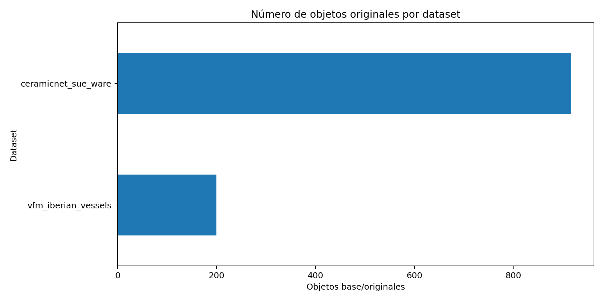

### Distribución por etiqueta — objetos originales

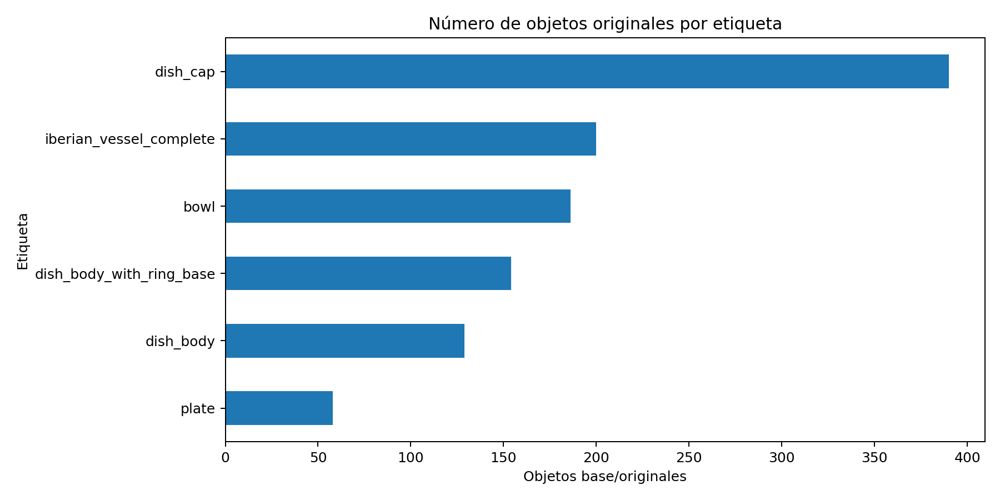

### Distribución por split — objetos originales

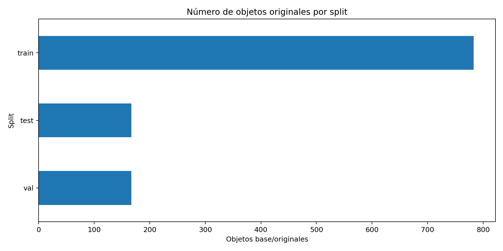

### Split por etiqueta — objetos originales

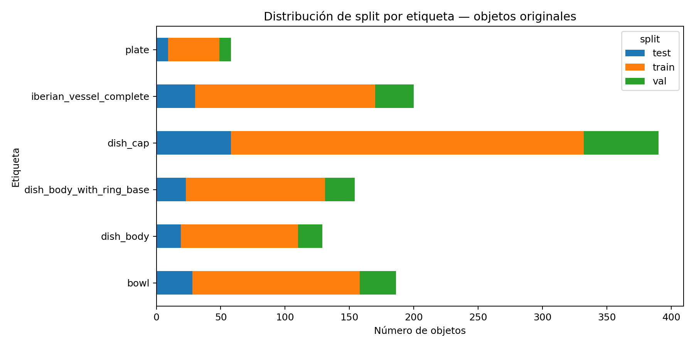

### PCA inicial con features geométricas — objetos originales

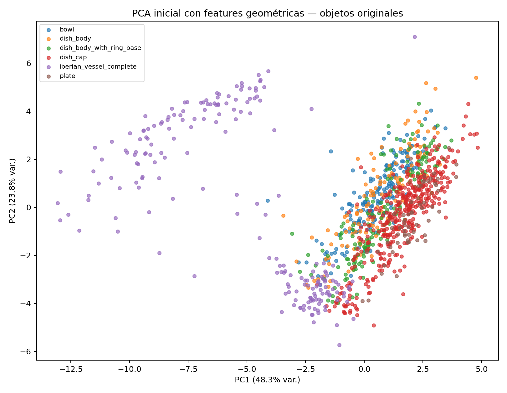

### Histogramas geométricos — objetos originales

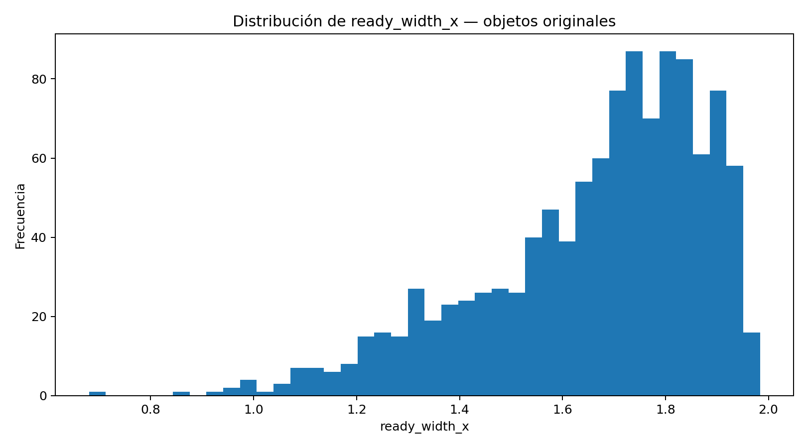

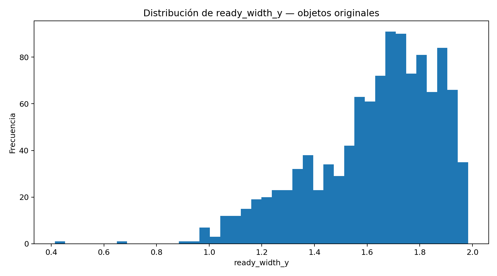

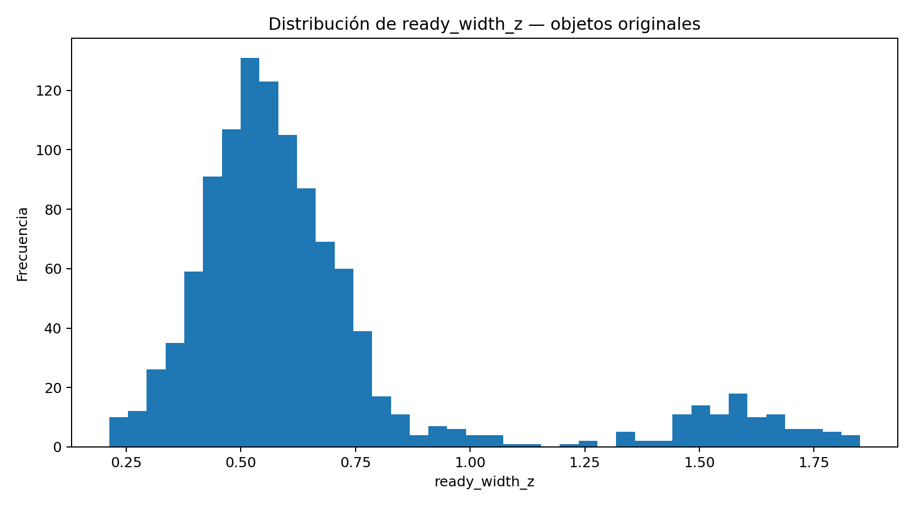

### Ejemplos de nubes de puntos

Los ejemplos visuales se encuentran en:

```text
reports/eda_objetos_originales/pointcloud_examples/
```
### Ejemplos visuales de objetos originales

Las siguientes figuras muestran ejemplos de nubes de puntos ya estandarizadas a `1024 x 3`.  
Cada punto representa una coordenada tridimensional `(x, y, z)` de la superficie del objeto.

| Clase | Ejemplo |
|---|---|
| Bowl — CeramicNet | 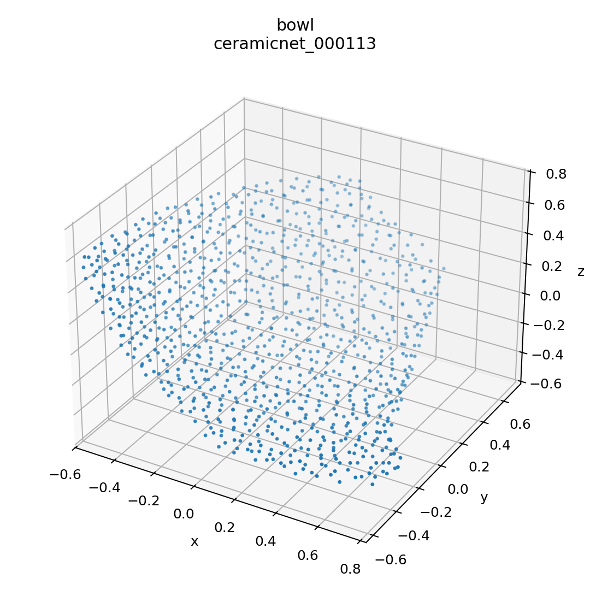 |
| Dish body — CeramicNet | 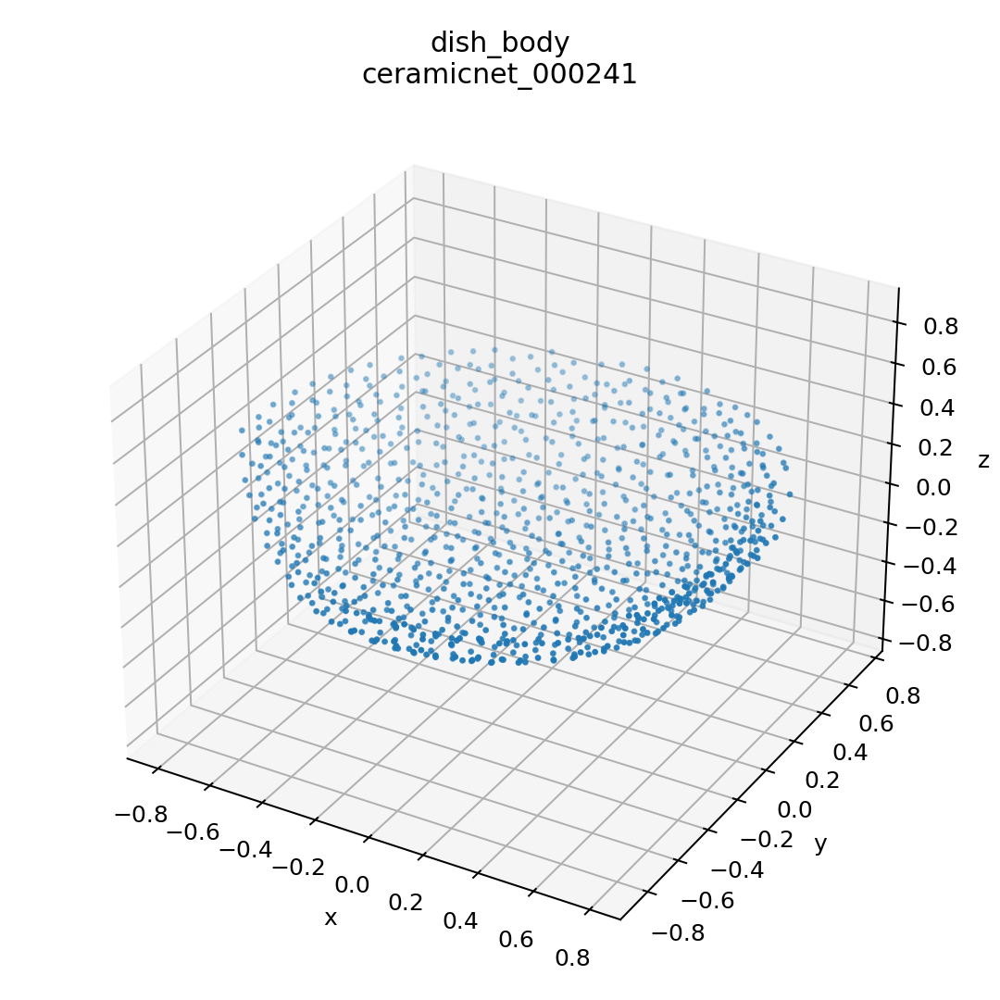 |
| Dish body with ring base — CeramicNet | 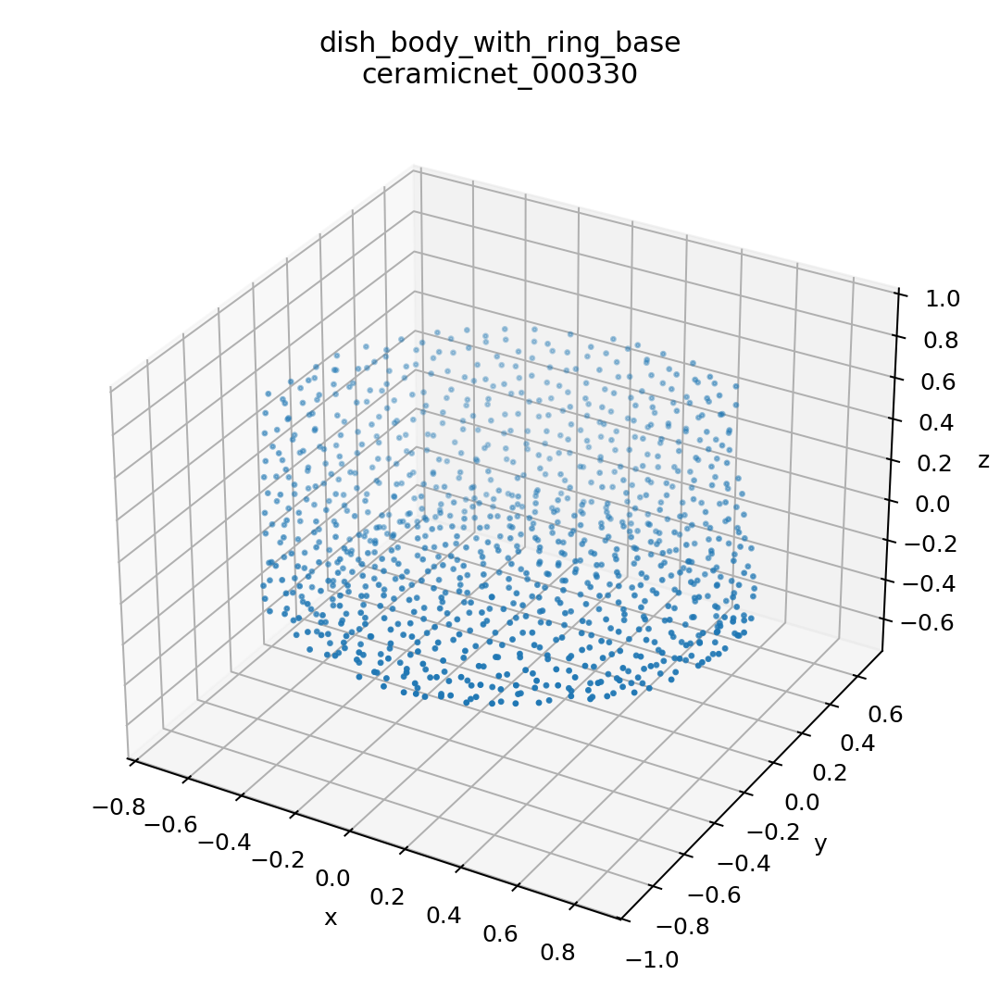 |
| Dish cap — CeramicNet | 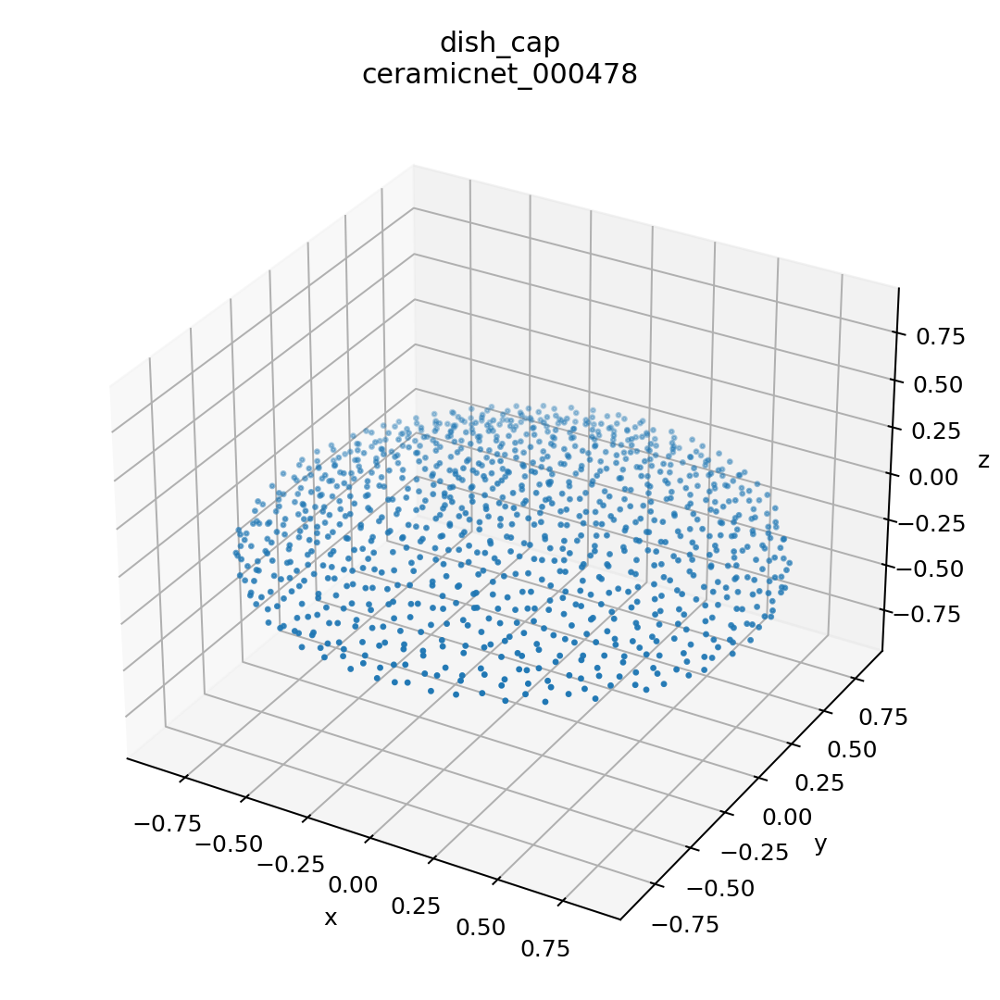 |
| Plate — CeramicNet | 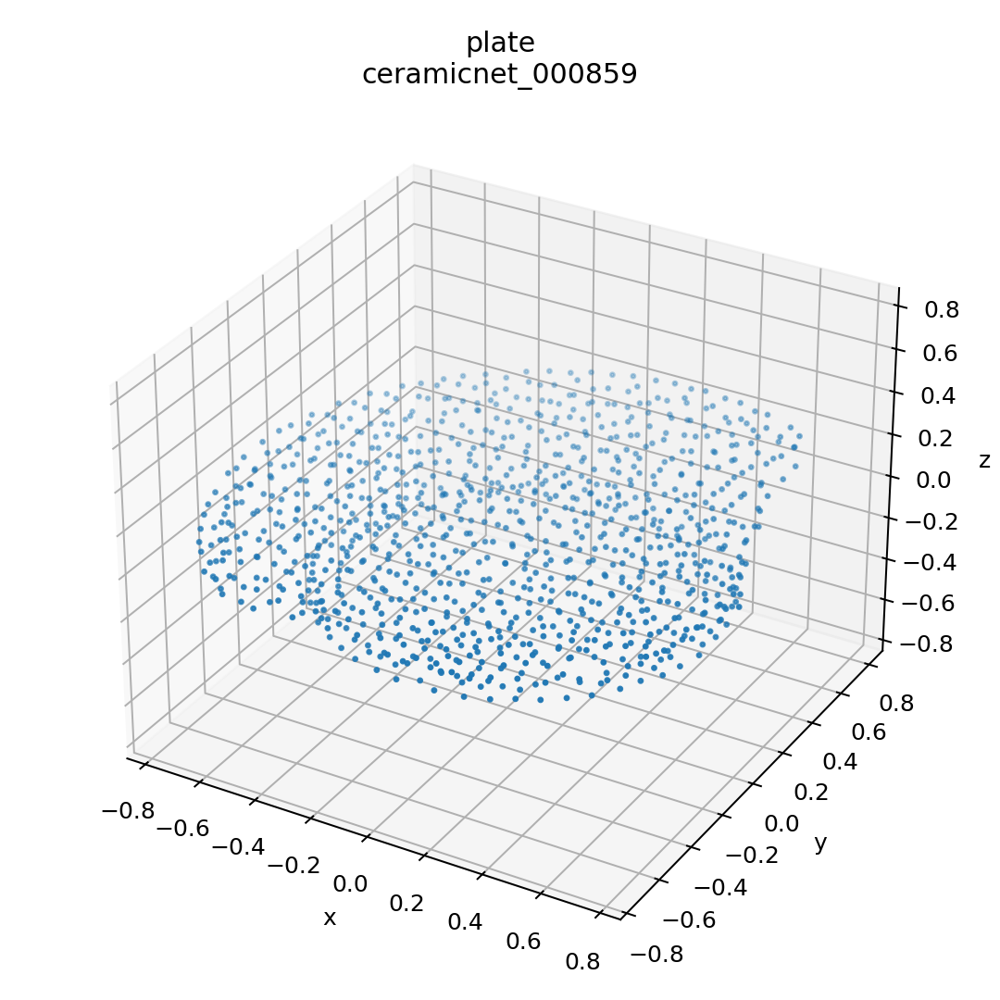 |
| Iberian vessel complete — VoxelFragmentML | 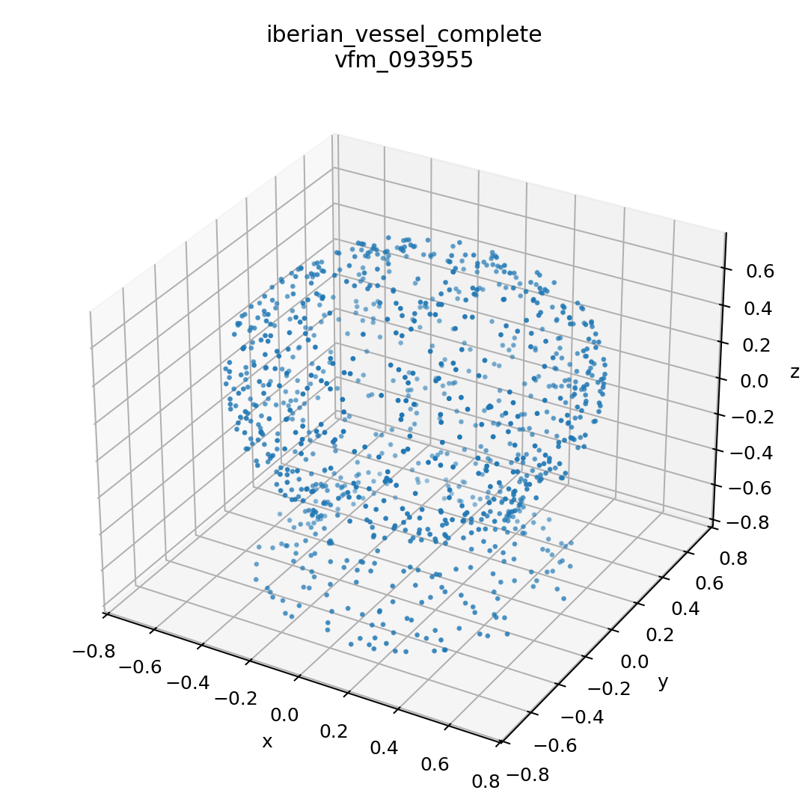 |

> Nota: estos ejemplos corresponden únicamente a objetos base/originales. Los fragmentos derivados de VoxelFragmentML se documentan por separado en el anexo de fragmentos.
### Anexo de fragmentos derivados

El análisis secundario de fragmentos derivados se encuentra en:

```text
reports/eda_objetos_originales/fragments_anexo/
```

---

## Archivos principales generados

### Dataset completo

```text
data/model_ready/index.csv
```

Este archivo contiene todas las muestras disponibles, incluyendo objetos base y fragmentos derivados.

### Dataset balanceado o capado para primer modelo

```text
data/model_ready/index_balanced_first_model.csv
```

Este archivo se recomienda para un primer modelo, porque el dataset completo está fuertemente dominado por fragmentos de VoxelFragmentML.

### Nubes de puntos procesadas

```text
data/model_ready/pointclouds/
```

Cada archivo `.npy` contiene una nube de puntos:

```text
1024 puntos x 3 coordenadas
```

### Reporte EDA principal

```text
reports/eda_objetos_originales/eda_original_objects_summary.md
```

---

## Consideraciones metodológicas

El dataset completo está muy desbalanceado porque VoxelFragmentML genera cientos de fragmentos por cada vasija base.

Por ejemplo:

```text
train ≈ 139,000 muestras
```

Esto no significa 139,000 objetos arqueológicos independientes. Significa que muchas muestras son fragmentos derivados de un número menor de vasijas base.

Por ello:

- para describir la colección arqueológica se usa el EDA de objetos base/originales;
- para documentar el volumen de datos disponible se conserva un anexo de fragmentos;
- para modelado inicial se recomienda usar el índice balanceado;
- los splits deben respetar `group_id` para evitar fuga de información.

---

## Estado actual

Actualmente se logró:

- descargar y revisar CeramicNet;
- descargar y revisar VoxelFragmentML light;
- leer archivos `.txt` como nubes XYZ;
- leer archivos `.ply` binarios como nubes XYZ;
- convertir todo a `.npy`;
- estandarizar todas las nubes a `1024 x 3`;
- corregir etiquetas de VoxelFragmentML;
- separar vasijas completas de fragmentos;
- crear splits train/val/test por grupo;
- crear índice completo;
- crear índice balanceado/capado para primer modelo;
- preparar EDA centrado en objetos originales/base;
- separar fragmentos derivados en un anexo.

---

## Pendientes

### Datos

- Si se requieren 2,000 objetos base, descargar la versión completa de VoxelFragmentML.
- La versión completa contiene 1,052 vasijas base, pero pesa aproximadamente 450 GB.
- Buscar repositorios adicionales para completar el número de objetos base si se requiere llegar a 2,000.

### EDA

- Revisar las gráficas generadas en `reports/eda_objetos_originales/plots/`.
- Revisar ejemplos visuales de nubes de puntos en `reports/eda_objetos_originales/pointcloud_examples/`.
- Revisar el anexo de fragmentos en `reports/eda_objetos_originales/fragments_anexo/`.
- Analizar si las clases de CeramicNet y VoxelFragmentML son comparables.
- Revisar distribución de variables geométricas por dataset y etiqueta.

### Modelado

Posibles modelos a explorar:

- PointNet como baseline.
- PointNet++.
- DGCNN.
- Autoencoders para nubes de puntos.
- Clustering geométrico.
- Clasificación por tipo de pieza.
- Clasificación fragmento vs vasija completa.

Para el primer modelo se recomienda no usar el dataset completo sin balancear.

---

## Instalación

Crear entorno virtual:

```bash
python3 -m venv .venv_3d
source .venv_3d/bin/activate
```

Instalar dependencias:

```bash
python -m pip install --upgrade pip
python -m pip install -r requirements.txt
```

---

## Ejecución completa

```bash
python scripts/01_unificar_datos.py
python scripts/02_preparar_dataset_model_ready.py
python scripts/02A_fix_vfm_labels_splits.py
python scripts/03_eda_inicial.py
```

---

## Notas sobre rutas locales

Los datos pesados no se incluyen en este repositorio. Las rutas locales usadas durante el desarrollo fueron:

```text
/Users/hectorperalta/Downloads/dv-wataru-tatsuda-ceramicnet-supplement-067914c/ceramicnet_data
/Users/hectorperalta/Downloads/Vessels_200_obj_ply
```

Estas rutas deben ajustarse si el proyecto se ejecuta en otra computadora.

---

